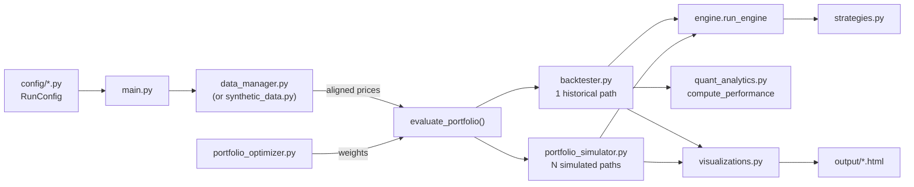
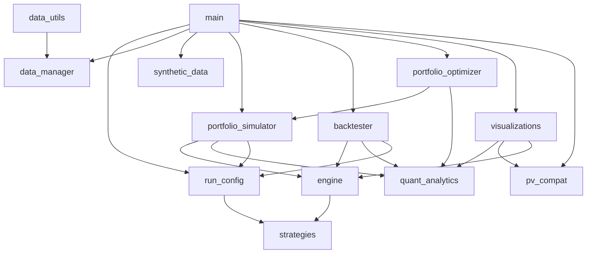

# Architecture

## Pipeline

## Engine step (per day, vectorized over paths)

1. `holdings *= 1 + r` for every asset
2. Update price indexes/peaks (asset drawdowns), the base-weight reference index, trailing return buffers
3. On decision days (contribution days, or `check_frequency`/rebalance days for `apply_to='rebalance'`), build a `MarketContext` and ask the strategy for target weights
4. Add the contribution, split by strategy weights (`apply_to` includes contributions) or base weights
5. Trade to target on calendar rebalance days, drift-band breaches, or strategy target changes; charge transaction costs
6. Day's time-weighted return = (value after trades − contribution) / previous value − 1

Historical runs schedule events on the first trading day of each calendar period; simulated runs space them evenly with `days_per_year` taken from the history.

## Monte Carlo return generators (`engine.SimulatedReturns`)

| method | draws |
|---|---|
| `bootstrap` | i.i.d. historical days (all assets from the same day) |
| `block_bootstrap` | circular blocks of `block_size` consecutive days |
| `geometric_brownian` | multivariate normal fitted to log returns, exponentiated |
| `parametric` | multivariate normal fitted to simple returns |

Inflation (`inflation_rate`) deflates every simulated return, so results are in today's dollars.

## Module dependencies

