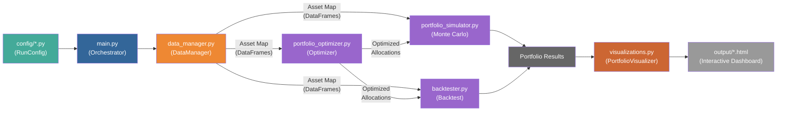
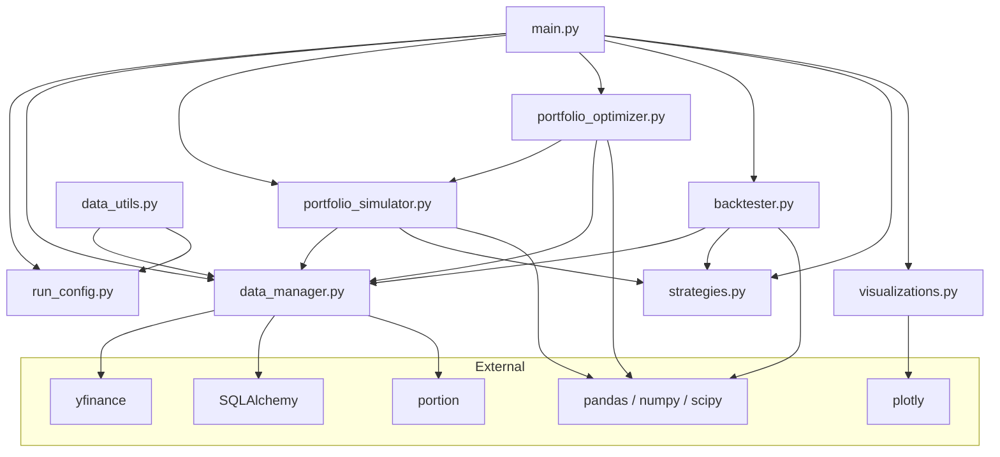
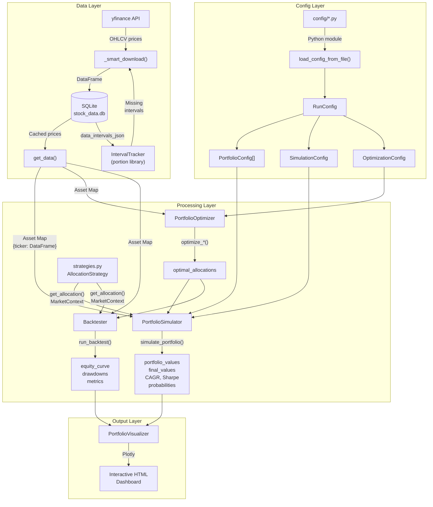
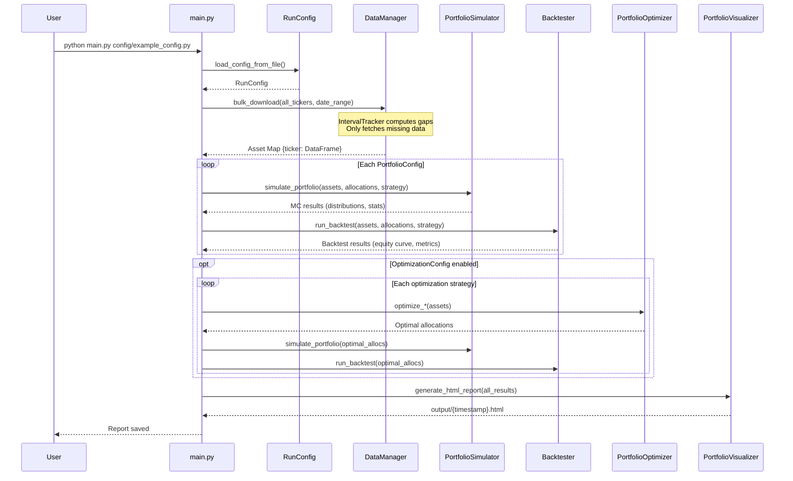

# Architecture Diagram

## High-Level Pipeline

## Module Dependency Map

## Data Flow

## Execution Pipeline (main.py)

## Main Features

### Monte Carlo Simulation
| Method | Description |
|--------|-------------|
| **Bootstrap** (default) | Resamples historical daily returns; preserves fat tails and real market behavior |
| **Geometric Brownian Motion** | Industry-standard GBM with drift and volatility from historical data |
| **Parametric** | Normal distribution sampling from historical mean/std |

- Vectorized NumPy with 2000-sim batch processing
- Supports DCA contributions with configurable frequency
- Calculates probability of loss, doubling, and custom targets

### Portfolio Optimization (SciPy SLSQP)
| Strategy | Objective |
|----------|-----------|
| **Max Sharpe** | Maximize risk-adjusted return |
| **Min Volatility** | Minimize portfolio variance |
| **Max Sortino** | Maximize downside-risk-adjusted return |
| **Risk Parity** | Equalize risk contribution across assets |
| **Custom Weighted** | Blend of objectives with user-defined weights |

- Per-asset min/max weight bounds
- Concentrated starting points for better convergence
- Data caching across optimization strategies

### Dynamic Allocation Strategies
| Strategy | Behavior |
|----------|----------|
| **Static** | Fixed allocation (baseline) |
| **Buy the Dip** | Increase target asset weight during drawdowns |
| **Momentum** | Tilt toward assets with positive momentum |
| **Volatility Target** | Adjust exposure to maintain target portfolio volatility |
| **Drawdown Protection** | Shift to defensive assets during market crashes |
| **Relative Value** | Overweight the most beaten-down assets |
| **Composite** | Blend multiple strategies with weights |
| **Conditional** | Switch strategy based on market regime |

- Rich `MarketContext` dataclass provides rolling stats, drawdowns, regime detection
- Used in both Monte Carlo simulation and backtesting

### Historical Backtesting
- Static (fast vectorized) and dynamic (time-stepped with strategies) modes
- DCA contribution modeling
- Metrics: CAGR, max drawdown, Sharpe ratio, Sortino ratio
- `StrategyComparison` class for side-by-side strategy evaluation

### Smart Data Caching
- `IntervalTracker` using `portion` library for precise date-range tracking
- Per-ticker gap detection — only fetches missing data from yfinance
- Failed download cooldown (1 hour) to prevent API thrashing
- Bulk download when all tickers need the same range; sequential otherwise
- `data_utils.py` CLI for coverage reports, sync, and manual downloads

### Visualization
- Interactive Plotly HTML dashboards
- Monte Carlo distribution curves with percentile bands
- Backtest equity curves indexed to 100
- Drawdown analysis and rolling returns
- Allocation tables with performance metrics
